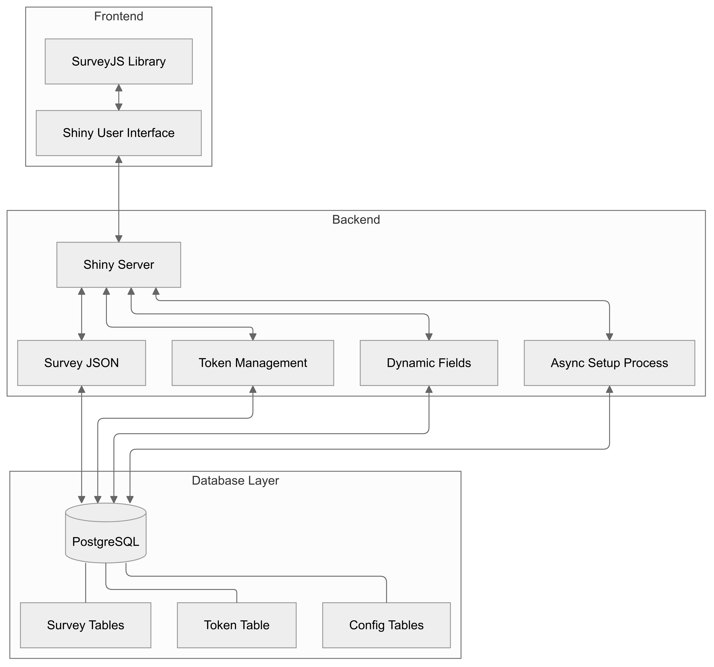
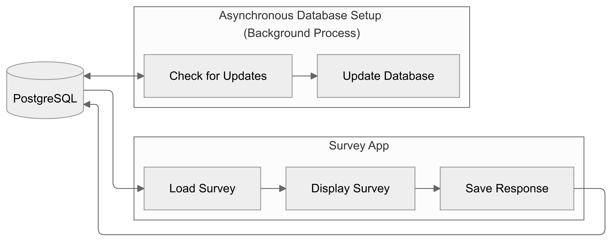

# ShinySurveyJS

Host multiple surveys in a single **Shiny** app using **SurveyJS** and **PostgreSQL**.


## Overview

ShinySurveyJS integrates the frontend flexibility of the [SurveyJS](https://surveyjs.io/) Javascript library with the backend capabilities of [Shiny](https://shiny.posit.co/) to interface with a database and create dynamic survey user experiences. While there are incredible Shiny survey packages like [surveydown](https://github.com/surveydown-dev/surveydown) and [shinysurveys](https://github.com/jdtrat/shinysurveys), they build the UI in R and are limited to a single survey per server.

## SurveyJS

[SurveyJS](https://surveyjs.io/) is "a free and open-source MIT-licensed JavaScript form builder library that allows you to design dynamic, data-driven, multi-language survey forms."

At its core is a powerful form-building engine, complemented by a user-friendly [visual editor](https://surveyjs.io/create-free-survey) to create JSON objects and extensive [documentation](https://surveyjs.io/documentation). Built on TypeScript with reactive components, the framework provides type safety and responsive design while working with any backend or database.

SurveyJS's features include conditional logic and branching, robust input validation, a wide variety of question types, customizable themes, multi-page layouts, and multi-language support—all of which make it a excellent choice for building complex survey applications.

ShinySurveyJS integrates with the lightweight [SurveyJS jQuery Form Library](https://www.npmjs.com/package/survey-jquery) as a core dependency.

## Key Features

-   Multiple surveys in a single app
-   Add, remove, or edit surveys without restarting the server
-   URL query parameters use database tables to enable participant tracking and dynamically updating field choices or text (i.e., survey item response options)
-   URL query tokens prevent user manipulation of public surveys
    -   Automatically generates and stores unique tokens in the database
    -   Supports multiple URL query parameters and configurations
    -   Enhances security by obscuring direct access and only accepting valid tokens
-   PostgreSQL cloud platforms like [Supabase](https://supabase.com/) offer free and paid database solutions

## Architecture

The ShinySurveyJS architecture integrates three main layers: a frontend that combines SurveyJS's JavaScript form library with Shiny's UI components, a backend layer powered by Shiny server that handles token management, dynamic field processing, and asynchronous database operations, and a PostgreSQL database layer that stores surveys, tokens, and dynamic field configurations. The system uses URL query parameters and tokenization for secure access control, while supporting multiple concurrent surveys through a single server instance. The architecture employs an asynchronous setup process that runs in the background to handle database updates and JSON staging, with built-in cooldown periods to manage server load. This modular design allows for flexible survey management, dynamic field updates, and secure data collection while maintaining scalability.

**Figure 1**. Application Layers



**Figure 2**. Two Processes



## Get Started

1.  Clone the repository:

``` bash
git clone https://github.com/dylanpieper/ShinySurveyJS.git
```

2.  Create a `.env` file, modifying the following template with your database credentials. In Supabase, you can find project connect details by clicking "Connect" in the top bar. Also use this file to set other environment variables.

``` env
DB_HOST=aws-0-us-east-2.pooler.supabase.com
DB_PORT=5432
DB_NAME=postgres
DB_USER=username
DB_PASSWORD=password
token_active=TRUE
token_table_name=tokens
survey_table_name=surveys
survey_show_response=TRUE
async_cooldown=30
shiny_host=0.0.0.0
shiny_port=3838
shiny_workers=100 
shiny_idle_timeout=1800
shiny_sanitize_errors=TRUE
shiny_autoreload=FALSE
```

**Don't forget to add a final new line to the `.env` file.**

3.  Install the required R packages:

``` r
if (!requireNamespace("pak", quietly = TRUE)) install.packages("pak")
pak::pkg_install(c("R6", "dotenv", "shiny", "jsonlite", "shinyjs", "sass",
                   "DBI", "RPostgres", "pool", "future", "promises", "DT"))
```

## Dynamic Fields

First, run the queries in `setup_examples.sql` to create the setup the `surveys`, `config_pid`, `config_vacation`, `config_doctor_clinic`, and `config_demographics` tables and insert the example data. In Supabase, you can run these queries by clicking "SQL Editor" in the sidebar.

### Option 1: Live Tables

For this option, dynamic fields are defined as Shiny server operations that track participants and reactively update field choices or text using the URL query and live database table reads. The `json_config` column in the `surveys` table is used to store the dynamic field configuration as a JSON object.

Create and manage your own dynamic fields table by mapping your fields to the `json_config` field in your `surveys` table as a JSON object:

-   `table_name`: The table name for the dynamic field configuration
-   `group_col`: The column name for the group column
-   `select_group`: A logical for using the group column to populate the choices or text in the JSON for user selection (`true`) or defining the group in the URL query for tracking (`false`)
    -   `group_id_table_name`: If `select_group` is `true`, the table name to locate the group ID column used in the query for participant tracking
    -   `group_id_col`: If `select_group` is `true`, the group ID column used in the query for participant tracking
-   `choices_col`: The column name for the choices to populate in the group column

An example of the JSON configuration in the `json_config` column:

``` json
{
  "table_name": "config_vacation",
  "group_col": "country",
  "select_group": true,
  "group_id_table_name": "config_pid",
  "group_id_col": "pid",
  "choices_col": "city"
}
```

See the `setup_examples.sql` file to examine how to dynamic field configuration tables (prefixed with `config_`) are structured.

Use underscores and don't include spaces and special characters for the `group_col` or `group_id_col` values used in the URL query. The app will automatically remove underscores when displaying the data.

While this option is useful for participant tracking and real-time updates, it requires additional database reads that can slow down the load time. Also, this option is not designed to handle a large number of dynamic fields without further customization in the `shiny/survey.R` file.

### Option 2: Staged JSON

For this option, dynamic field configurations are stored as JSON objects in the `json_stage` column of the `surveys` table. After a survey is loaded, the asynchronous setup process reads the `json_stage` configuration and rewrites the `json` column if updates are available in the background using the [future](https://github.com/futureverse/future) package. The JSON staging table may have the following columns, for example:

-   `field_name`: The field name (e.g., age_group)
-   `field_type`: The field type (e.g., radiogroup)
-   `choices`: The field choices (e.g., ['18-24', '25-34', '35-44', '45-54', '55-64', '65 or older'])

This method is useful for staging the JSON configuration with an unlimited number of dynamic fields and no database table reads. However, this option is not designed for participant tracking or real-time updates.

To prevent user load, the asynchronous setup process has a cooldown feature that can only be run by one session every 30 seconds (set as `async_cooldown` in `.env`). The worker runs in the background when the app is initialized and will not interfere with the user experience.

An example of the R/JSON hybrid syntax in the `json_stage` column:

``` json
{
    "type": config_demographics["age_group", "field_type"],
    "name": "age_group",
    "title": "What is your age group?",
    "isRequired": true,
    "choices": config_demographics["age_group", "choices"]
}
```

## Example Surveys

These examples show how to use dynamic fields to track participants and/or update field choices using URL query parameters and database tables. The dynamic field server logic can be customized in `shiny/survey.R`.

1.  **survey_llm**: Assign participant ID in URL query with no selections for group or additional choices

    ```         
    /?survey=survey_llm&pid=Sam_Altman
    ```

    -   Use curly brackets with a hidden `pid` field in the json to reactively display the URL query parameter strings

    -   You are not allowed to enter an invalid `pid` to avoid user manipulation

2.  **survey_vacation**: Select group (country) from a database table with no additional choices or participant tracking

    ```         
    /?survey=survey_vacation
    ```

3.  **survey_vacation_query_group**: Assign group (country) in URL query and select filtered choices (city) from a database table

    ```         
    /?survey=survey_vacation_query_group&country=USA
    ```

4.  **survey_vacation_select_group**: Select group (country) and additional choices (city) from a database table

    ```         
    /?survey=survey_vacation_select_group
    ```

5.  **survey_vacation_group_id**: Select group (country) and additional choices (city) from a database table with participant tracking

    ```         
    /?survey=survey_vacation_select_group&pid=Sam_Altman
    ```

6.  **survey_doctor_clinic**: Assign group ID to doctors in URL query with a selection for the clinic they worked in

    ```         
    /?survey=survey_doctor_clinic&doctor=Sarah_Chen
    ```

7.  **survey_product_feedback**: Static survey with no dynamic fields

    ```         
    /?survey=survey_product_feedback
    ```

8.  **survey_protected_feedback**: Static survey with simple password protection built into the survey JSON

    ```         
    /?survey=survey_product_feedback
    ```

9.  **survey_demographics**: Static survey with field choices from a staged JSON table

    ```         
    /?survey=survey_demographics
    ```

    Example #9 also implements different coded values and display text.

## Tokenization

Tokenization is a security process that replaces sensitive data like a survey name or a dynamic field group name with non-sensitive placeholders like a randomly generated string (e.g., `NovaRemnantGoldFourHundredNinetyTwo`).

1.  Run the app:

``` r
runApp()
```

If the `tokens` table does not exist yet, the asynchronous setup process will automatically create it. The app will also generate tokens for each survey and store them in the database.

If new tokens are created, users can access them on the next page load after the process runs. You can customize the tokenization algorithm in `shiny/tokens.R`.

2.  Set the `.env` file to `token_active=TRUE`
3.  Access survey with URL query parameters:
    -   Without tokens (same as survey name): `/?survey=name`
    -   With tokens (in the database table): `/?survey=token`

## Activation and Dates

Each survey can be activated or deactivated by setting the `active` column in the `surveys` table to `TRUE` or `FALSE`. You can set a time window for each survey by defining the `date_start` and `date_end` columns in the `surveys` table. The app will automatically check the current time against the time window and the activation status of the survey.

## Data Output

Upon submission, survey responses are automatically stored in a database table named according to the `survey_name`. If the table doesn't exist, the system creates it, and if the table already exists, the system updates it. Each survey response is saved along with the following metadata in the corresponding table:

-   `session_id` Shiny session ID
-   `ip_address`: IP address of the user
-   `duration_load`: Seconds it took to load the survey
-   `duration_complete`: Number of seconds it took to complete the survey
-   `date_created`: Timestamp when the survey was created
-   `date_updated`: Timestamp when the survey was updated in the database

## Database Driver

Easily change the database driver in `database.R` to use any database system compatible with the `DBI` package (see [list of backends](https://github.com/r-dbi/backends#readme)). The `RPostgres` package is used by default.

## Performance

Because all of the tokens and surveys are retrieved directly from the database, the app may be slow to load if there are many Shiny sessions open concurrently or if the database server is slow.

Locally, using the nearest Supabase server, I observe **2 to 3 second** **load times** on average.

To improve performance, consider the following:

-   Use a database with fast read and write speeds
-   Optimize the queries used to retrieve the tokens and surveys
-   Cache the database tables in memory (e.g., using [Redis](https://redis.io/) via the [redux](https://github.com/richfitz/redux) package)

## Publishing

The default Shiny app settings are found in the `shiny/shiny.R` file (e.g., host, port, and number of workers). Publish directly to a cloud platform like [Shinyapps.io](https://www.shinyapps.io/) or setup the app in a container on a service like [Azure Web Apps](https://azure.microsoft.com/en-us/products/app-service/web). When scaling up, consider adding traffic monitoring, load testing, and node balancing or container clustering.

## Roadmap

-   ✔️ URL query parameter tokenization
-   PostgreSQL
    -   ✔️ Tokens and dynamic fields handled in database
    -   ✔️ Staged JSON configuration
    -   ✔️ Survey data is written to database
-   🚧 Admin interface to generate links for sharing surveys
-   🚧 Cookies to cache survey data
-   🚧 Package for R6 classes
-   🚧 [Sentry](https://github.com/jcpsantiago/sentryR) support
-   🚧 Container support

## Disclaimer

This application template was not built with comprehensive security features. It lacks the robust implementation and testing of secure authentication methods, user management, private data encryption, and protection against common vulnerabilities and malicious attacks. Users of this application template must implement their own security measures and accept all associated risks when deploying it. No warranty is provided.
