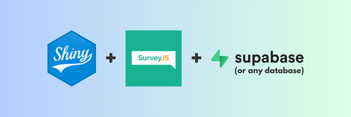

# ShinySurveyJS

Host multiple surveys in a single **Shiny** app using **SurveyJS** and **PostgreSQL**.



## Overview

ShinySurveyJS integrates the front-end flexibility of the [SurveyJS](https://surveyjs.io/) Javascript library with the back-end capabilities of [Shiny](https://shiny.posit.co/) to interface with a database and create dynamic survey user experiences. While there are incredible Shiny survey packages like [surveydown](https://github.com/surveydown-dev/surveydown) and [shinysurveys](https://github.com/jdtrat/shinysurveys), they build the UI in R and are limited to a single survey per server.

## SurveyJS

[SurveyJS](https://surveyjs.io/) is a "a free and open-source MIT-licensed JavaScript form builder library that allows you to design dynamic, data-driven, multi-language survey forms".

At its core is a powerful form-building engine, complemented by a user-friendly [visual editor](https://surveyjs.io/create-free-survey) and extensive [documentation](https://surveyjs.io/documentation). Built on TypeScript with reactive components, the framework provides type safety and responsive design while working seamlessly with any backend or database.

SurveyJS's features include conditional logic and branching, robust input validation, a wide variety of question types, customizable themes, multi-page layouts, and multi-language support—all of which make it a excellent choice for building complex survey applications.

The current implementation of ShinySurveyJS specifically uses the [SurveyJS jQuery Form Library](https://www.npmjs.com/package/survey-jquery).

## Key Features

-   Multiple surveys in a single app
-   URL query parameters use database tables to enable participant tracking and/or dynamically updating field choices (i.e., survey item response options)
-   URL query tokens prevent user manipulation of public surveys
    -   Automatically generates and stores unique tokens in the database
    -   Supports multiple URL query parameters and configurations
    -   Enhances security by obscuring direct access and only accepting valid tokens
-   PostgreSQL cloud platforms like [Supabase](https://supabase.com/) offer free and paid database solutions

## Get Started

1.  Clone the repository:

``` bash
git clone https://github.com/dylanpieper/ShinySurveyJS.git
```

2.  Create a `.env` file, modifying the following template with your database credentials. In Supabase, you can find project connect details by clicking "Connect" in the top bar.

``` env
DB_HOST=aws-0-us-east-2.pooler.supabase.com
DB_PORT=5432
DB_NAME=postgres
DB_USER=username
DB_PASSWORD=password
token_active=TRUE
show_response=TRUE
token_table_name=tokens
survey_table_name=surveys
```

3.  Install the required R packages:

``` r
if (!requireNamespace("pak", quietly = TRUE)) install.packages("pak")
pak::pkg_install(c("R6", "dotenv", "shiny", "jsonlite", "shinyjs",
                   "DBI", "RPostgres", "pool", "future", "promises", "DT"))
```

## Dynamic Fields

First, run the queries in `setup_example.sql` to create the setup the `surveys`, `config_pid`, `config_vacation`, `config_doctor_clinic`, and `config_staged_json` tables and insert the example data. In Supabase, you can run these queries by clicking "SQL Editor" in the sidebar.

### Option 1: Live Tables

For this option, dynamic fields are defined as Shiny server operations that track participants and/or reactively update field choices or text using the URL query and live database table reads. The `config_json` column in the `surveys` table is used to store the dynamic field configuration as a JSON object. While this option is useful for participant tracking and real-time updates, it requires additional database reads that can slow down the app's loading time. Also, this option is not designed to handle a large number of dynamic fields without further customization.

Optionally, create and manage your own dynamic fields table by mapping your fields to the `config_json` field in your `surveys` table as a JSON object:

-   `table_name`: The table name for the dynamic field
-   `group_col`: The column name that will be used to filter the dynamic fields
-   `select_group`: A logical for using the group column to populate the field choices in the JSON field (true) or defining the group in the URL query for tracking (false)
    -   `group_id_table_name`: If `select_group` is true, the table name to locate the group ID column used in the query for participant tracking
    -   `group_id_col`: If `select_group` is true, the group ID column used in the query for participant tracking
-   `choices_col`: The column name used to populate the field choices

An example of the JSON configuration in the `config_json` column:

``` json
{
  "table_name": "config_vacation",
  "group_col": "country",
  "select_group": true,
  "group_id_table_name": "config_pid",
  "group_id_col": "pid",
  "choices_col": "city"
}
```

Don't include spaces and special characters for the `group_col` or `group_id_col` value if you use them in the URL query. The app will automatically remove underscores when storing or displaying the data.

### Option 2: Staged JSON

For this option, dynamic field configurations are stored as JSON objects in the `staged_json` column of the `surveys` table. After a survey is loaded, an asynchronous worker reads the `staged_json` configuration and re-writes the `json` column if updates are available. The table name for the staged JSON configuration is located in the `staged_json_field_name` column. The table should have the following columns:

-   `field_name`: The field name for the dynamic field (e.g., age_group)
-   `field_type`: The field type for the dynamic field (e.g., radiogroup)
-   `choices`: The field choices for the dynamic field (e.g., ['18-24', '25-34', '35-44', '45-54', '55-64', '65 or older'])

This method is useful for staging the JSON configuration with an unlimited number of dynamic fields and no database table reads. However, this option is not designed for participant tracking or real-time updates.

An example of the R/JSON hybrid syntax in the `staged_json` column:

``` json
{
    "type": config_staged_json["age_group", "field_type"],
    "name": "age_group",
    "title": "What is your age group?",
    "isRequired": true,
    "choices": config_staged_json["age_group", "choices"]
}
```

## Example Surveys

These examples show how to use dynamic fields to track participants and/or update field choices using URL query parameters and database tables. The dynamic field server logic can be customized in `shiny/survey.R`.

1.  **survey_llm**: Assign participant ID in URL query with no selections for group or additional choices

    ```         
    /?survey=survey_llm&pid=Sam_Altman
    ```

    -   Use curly brackets with a hidden `pid` field in the json to reactively display the URL query parameter strings

    -   You are not allowed to enter an invalid `pid` to avoid user manipulation

2.  **survey_vacation**: Select group (country) from a database table with no additional choices or participant tracking

    ```         
    /?survey=survey_vacation
    ```

3.  **survey_vacation_query_group**: Assign group (country) in URL query and select filtered choices (city) from a database table

    ```         
    /?survey=survey_vacation_query_group&country=USA
    ```

4.  **survey_vacation_select_group**: Select group (country) and additional choices (city) from a database table

    ```         
    /?survey=survey_vacation_select_group
    ```

5.  **survey_vacation_group_id**: Select group (country) and additional choices (city) from a database table with participant tracking

    ```         
    /?survey=survey_vacation_select_group&pid=Sam_Altman
    ```

6.  **survey_doctor_clinic**: Assign group ID to doctors in URL query with a selection for the clinic they worked in

    ```         
    /?survey=survey_doctor_clinic&doctor=Sarah_Chen
    ```

7.  **survey_product_feedback**: Static survey with no dynamic fields

    ```         
    /?survey=survey_product_feedback
    ```

8.  **survey_protected_feedback**: Static survey with simple password protection built into the survey JSON

    ```         
    /?survey=survey_product_feedback
    ```

9.  **survey_staged_json**: Static survey with field choices from a staged JSON table

    ```         
    /?survey=survey_staged_json
    ```

## Tokenization

Tokenization is a security process that replaces sensitive data like a survey name or an individual's name with non-sensitive placeholders like a randomly generated value or string.

Using tokens requires an additional table read to a look-up table, making it a slower process since each token must be converted back to its original data. Tokens are generated as a background task of the app using parallelization, meaning the work is split across multiple simultaneous processes for faster completion. If new tokens are created, users can access them on the next page load after the process runs. You can customize the tokenization algorithm in `shiny/tokens.R`.

1.  Run the app:

``` r
runApp()
```

If the `tokens` table does not exist yet, the app will automatically create it. The app will also generate tokens for each survey and store them in the database.

To prevent user load, the asynchronous setup process is randomly assigned a time delay between 1 and 10 seconds before running. The worker runs in the background when the app is initialized and will not interfere with the user experience.

2.  Access survey with URL query parameters:
    -   Without tokens (same as JSON file name): `/?survey=name`
    -   With tokens: `/?survey=token`

## Database Driver

Easily change the database driver in `database.R` to use any database system compatible with the `DBI` package (see [list of backends](https://github.com/r-dbi/backends#readme)). The `RPostgres` package is used by default.

## Roadmap

-   ✔️ Friendly initialization UI
-   ✔️ URL parameter tokenization
-   PostgreSQL
    -   ✔️ Tokens and dynamic fields handled in database
    -   ✔️ Staged JSON configuration
    -   🚧 Survey data is written to database
-   🚧 Admin interface to generate links for sharing surveys
-   🚧 Cookies to cache survey data
-   🚧 Container support

## Disclaimer

This application template was not built with comprehensive security features. It lacks the robust implementation and testing of secure authentication methods, user management, private data encryption, and protection against common vulnerabilities like SQL injection. It is not suitable for production use. Users must implement their own security measures and accept all associated risks. No warranty is provided.
